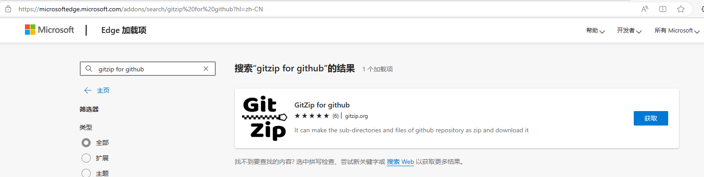
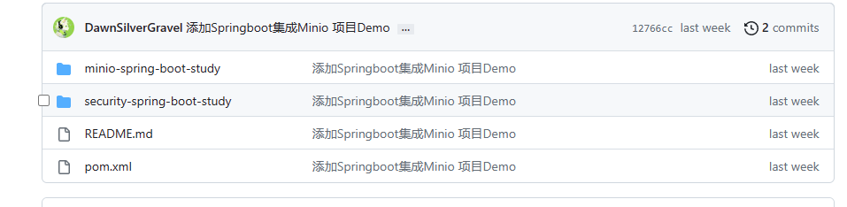
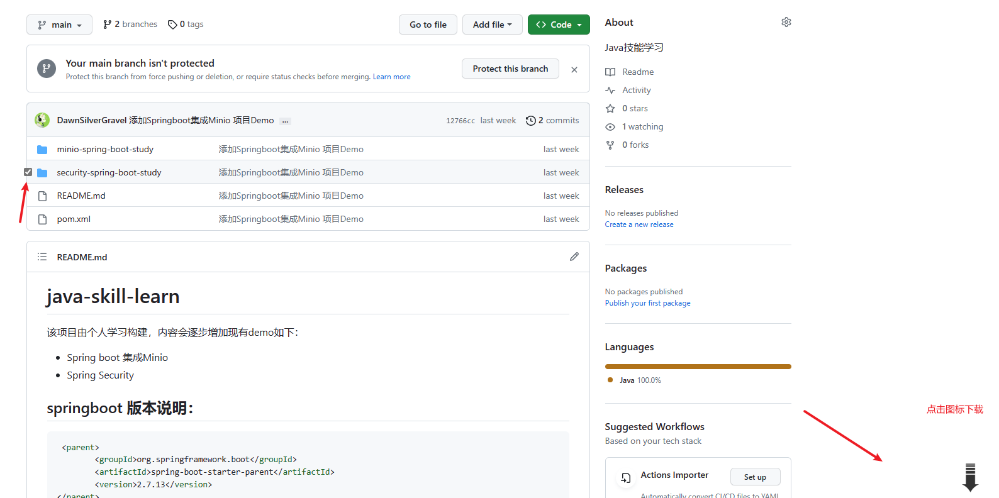

# java-skill-learn

该项目由个人学习构建，内容会逐步增加现有demo如下：

- [SpringBoot 集成 **MinIO**](./minio-spring-boot-study/README.md)
- [SpringBoot 集成 **MQTT**](./mqtt-spring-boot-study/README.md)
- [Spring Security 5.7](./security-spring-boot-study/README.md)
- [SpringBoot 集成 **Redis**](./redis-spring-boot-study/README.md)
- [SpringBoot 集成 **Websocket** 四种方式](./websocket-spring-boot-study/README.md)
- [SpringBoot自动配置](./study-spring-boot-test/README.md)
- [SpringBoot AOP](./aop-spring-boot-study/README.md)

## 环境版本说明：

- springboot2.7
- JDK 17

```xml

<parent>
    <groupId>org.springframework.boot</groupId>
    <artifactId>spring-boot-starter-parent</artifactId>
    <version>2.7.13</version>
</parent>
```

```xml

<properties>
    <maven.compiler.source>17</maven.compiler.source>
    <maven.compiler.target>17</maven.compiler.target>
    <project.build.sourceEncoding>UTF-8</project.build.sourceEncoding>
</properties>
```

## 下载子项目

以Microsoft Edge浏览器为例：下载GitZip for Github扩展

[GitZip 扩展](https://microsoftedge.microsoft.com/addons/search/gitzip%20for%20github?hl=zh-CN)







