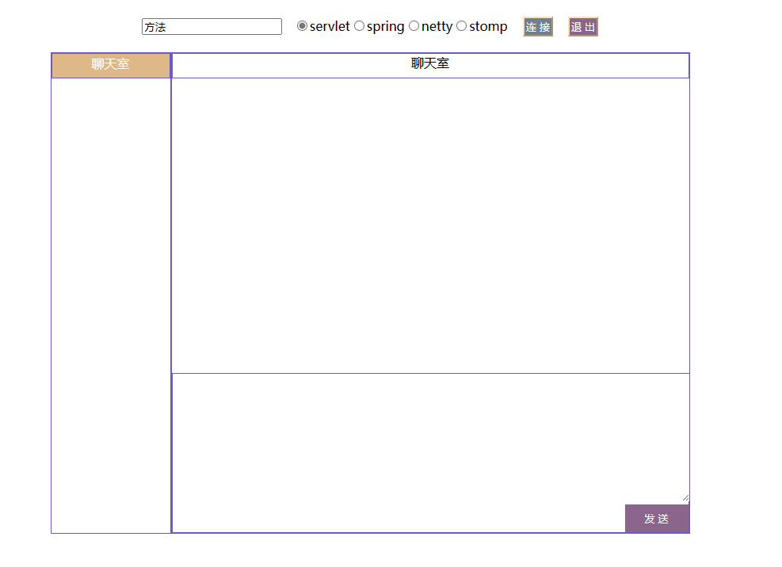

## Springboot 集成 Websocket 以及 使用的四种方式

### 环境配置
- JDK 17
- Springboot 2.7

### 简要介绍

该项目示例通过四种方式实现一个简要的聊天室，方式有：
- servlet
- spring
- Netty
- Stomp

实现的功能有：获取在线用户、用户上下线通知、用户群聊和私聊、用户挤退功能。

**注意**：每个方式都是独立，只有相同方式登录的用户才可以通信。

http://localhost:8899/index.html 为聊天室。

http://localhost:8899/stomp.html 为官方的一个stomp的示例，稍微做了一下改动。

如果index.html不能正常运行，则请使用以下其中一个路径加载vue
```html
    <script src="https://unpkg.com/vue@3/dist/vue.global.js"></script>
    <script src="https://cdnjs.cloudflare.com/ajax/libs/vue/3.3.4/vue.cjs.js"></script>
    <script src="https://cdn.jsdelivr.net/npm/vue@3.3.4/dist/vue.global.min.js"></script>
```

正常页面如下：


